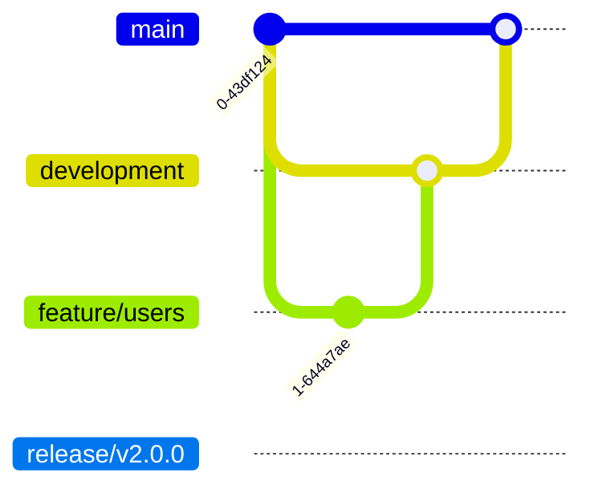

# Gitflow

```mermaid
gitGraph
 commit
 branch development
 branch feature/users
 commit
 checkout development
 merge feature/users
 branch release/v2.0.0
 checkout main
 merge release/v2.0.0
```

Ramas: `main`, `development`, `feature/*`, `release/*`, `hotfix/*`. Convención: `Descripción. Fix #n`.
